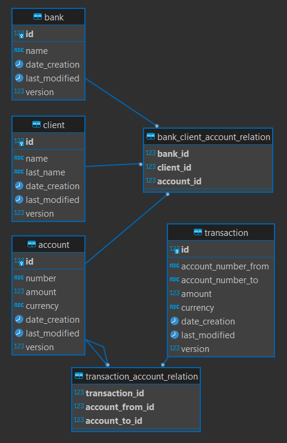

# Clever-Bank

**Автор Евгений Гарбузов**

***

### Параметры приложения, библиотеки и зависимости

- Java 17
- Gradle 7.5.1
- PostgreSQL JDBC Driver
- Java Servlet API
- Project Lombok
- SnakeYAML
- Gson
- IText 7
- JUnit 5

Для работы с приложением локально требуется Apache Tomcat и Docker.

Перед началом работы необходимо выполнить команду `docker compose up` для создания контейнера PostgreSQL с заполненной базой данных.

Реализованы формирование [чека](check/transaction_example.pdf "transaction_example.pdf") по транзакции
и формирование [выписки](statement-money/account_transactions_example.pdf "account_transactions_example.pdf") по всем транзакциям счета
в формате pdf.

Реализован функционал начислений по процентной ставке в последний день месяца.

***

### Схема базы данных

***

### Примеры HTTP-запросов

|<!-->|<!-->|<!-->|
|:----|:----|:----|
|**Банки**       | | |
|найти по ID     |**GET** find by ID            |http://localhost:8080/banks?id=1                                                                                         |
|найти все       |**GET** find all              |http://localhost:8080/banks                                                                                              |
|сохранение      |**POST** save                 |http://localhost:8080/banks?id=10&name=BANKNAME                                                                          |
|удаление по ID  |**DELETE** delete by ID       |http://localhost:8080/banks?id=10                                                                                        |
|**Пользователи**| | |
|найти по ID     |**GET** find by ID            |http://localhost:8080/clients?id=1                                                                                       |
|найти всех      |**GET** find all              |http://localhost:8080/clients                                                                                            |
|сохранение      |**POST** save                 |http://localhost:8080/clients?id=100&name=NAME&lastName=LASTNAME                                                         |
|удаление по ID  |**DELETE** delete by ID       |http://localhost:8080/clients?id=100                                                                                     |
|**Счета**       | | |
|найти по ID     |**GET** find by ID            |http://localhost:8080/accounts?id=1                                                                                      |
|найти все       |**GET** find all              |http://localhost:8080/accounts                                                                                           |
|сохранение      |**POST** save                 |http://localhost:8080/accounts?id=100&number=1111333355557777&amount=1000&currency=USD                                   |
|удаление по ID  |**DELETE** delete by ID       |http://localhost:8080/accounts?id=100                                                                                    |
|**Транзакции**  | | |
|найти по ID     |**GET** find by ID            |http://localhost:8080/transactions?id=1                                                                                  |
|найти все       |**GET** find all              |http://localhost:8080/transactions                                                                                       |
|сохранение      |**POST** save                 |http://localhost:8080/transactions?id=100&accountNumberFrom=0000000000000001&accountNumberTo=0000000000000111&amount=1000|
|удаление по ID  |**DELETE** delete by ID       |http://localhost:8080/transactions?id=100                                                                                |
|выполнение      |**POST** transaction execution|http://localhost:8080/transactions?accountNumberFrom=0000000000000001&accountNumberTo=0000000000000111&amount=1000       |

***